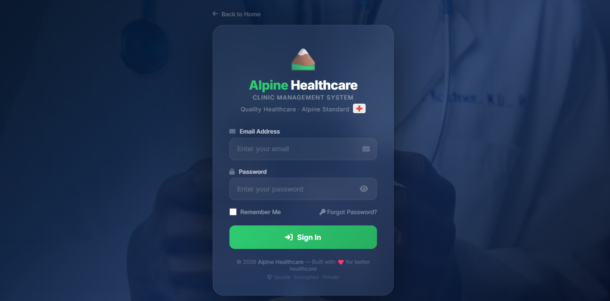
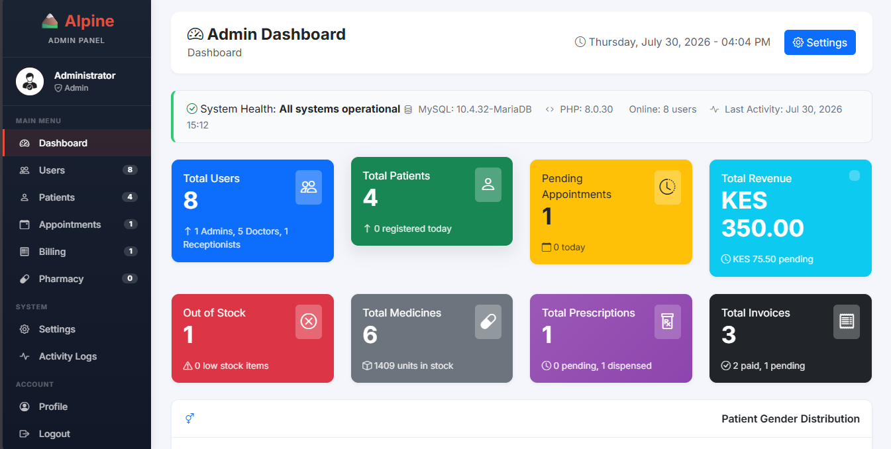
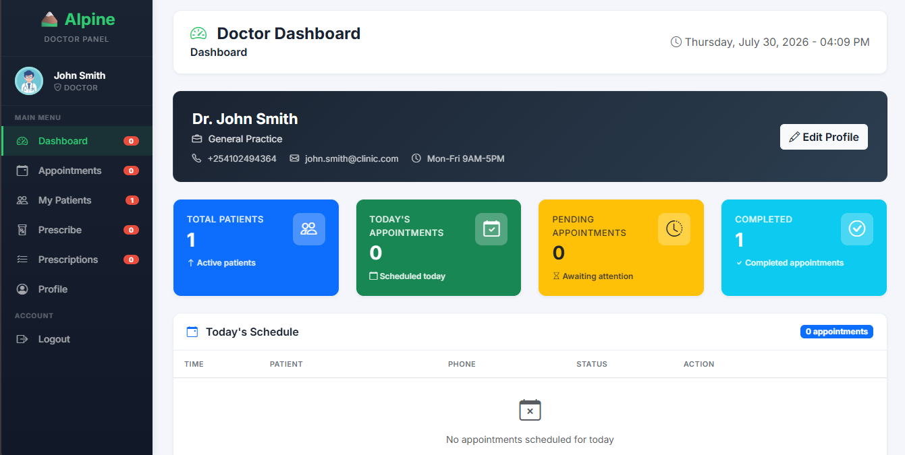
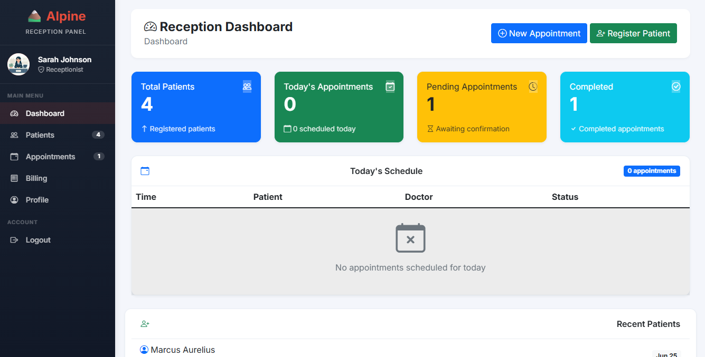
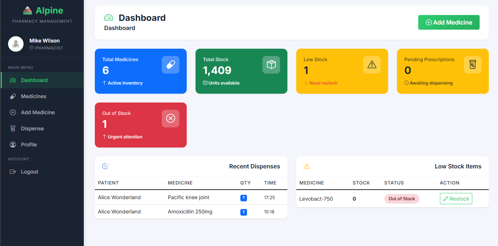

# 🏔️ Alpine Healthcare - Clinic Management System

[](https://php.net)
[](https://mysql.com)
[](https://getbootstrap.com)
[](LICENSE)
[](http://makeapullrequest.com)

> **A comprehensive web-based Clinic Management System designed to streamline healthcare operations, manage patient records, appointments, billing, and pharmacy inventory.**

---

## 📋 Table of Contents

- [Overview](#-overview)
- [Features](#-features)
- [Technology Stack](#-technology-stack)
- [Installation Guide](#-installation-guide)
- [Database Setup](#-database-setup)
- [Configuration](#-configuration)
- [Default Credentials](#-default-credentials)
- [User Manual](#-user-manual)
  - [Admin Panel](#admin-panel)
  - [Doctor Panel](#doctor-panel)
  - [Reception Panel](#reception-panel)
  - [Pharmacy Panel](#pharmacy-panel)
- [Navigation Guide](#-navigation-guide)
- [Project Structure](#-project-structure)
- [Screenshots](#-screenshots)
- [Troubleshooting](#-troubleshooting)
- [Contributing](#-contributing)
- [License](#-license)
- [Support](#-support)

---

## 🏥 Overview

**Alpine Healthcare** is a powerful, web-based Clinic Management System built with PHP, MySQL, and Bootstrap. It provides a complete solution for managing medical clinics, from patient registration to billing and pharmacy management.

### 🎯 Key Benefits

| Benefit | Description |
|---------|-------------|
| **Efficiency** | Reduce patient waiting time by 50% |
| **Accuracy** | Eliminate manual errors in records and billing |
| **Security** | Role-based access control with encrypted data |
| **Scalability** | Designed to grow with your clinic |
| **Accessibility** | Access from any device with a browser |

---

## ✨ Features

### 👨‍💼 Admin Panel
| Feature | Description |
|---------|-------------|
| **User Management** | Add, edit, delete, and manage system users with role assignments |
| **Patient Management** | Complete patient records with medical history |
| **Appointment Management** | View and manage all clinic appointments |
| **Billing & Invoicing** | Generate, view, and manage invoices |
| **Pharmacy Management** | Oversee medicine inventory and stock levels |
| **System Settings** | Configure clinic details and system preferences |
| **Activity Logs** | Track all user activities with detailed audit trails |
| **Reports & Analytics** | Generate comprehensive reports on clinic performance |

### 👨‍⚕️ Doctor Panel
| Feature | Description |
|---------|-------------|
| **Dashboard** | View statistics and today's schedule at a glance |
| **Appointment Management** | View, manage, and cancel appointments |
| **Patient Records** | Access complete patient medical history |
| **Prescribe Medication** | Write and manage prescriptions |
| **Prescription History** | View all past prescriptions |
| **Profile Management** | Update personal and professional information |

### 🏥 Reception Panel
| Feature | Description |
|---------|-------------|
| **Patient Registration** | Register new patients quickly |
| **Appointment Booking** | Book and manage appointments |
| **Queue Management** | Manage patient flow efficiently |
| **Billing** | Generate and manage invoices |
| **Patient Search** | Quick search by name or phone |
| **Dashboard** | View today's appointments and statistics |

### 💊 Pharmacy Panel
| Feature | Description |
|---------|-------------|
| **Inventory Management** | Track all medicines in stock |
| **Stock Alerts** | Get notified of low stock items |
| **Dispense Medication** | Process prescription fulfillment |
| **Medicine Management** | Add, edit, and delete medicines |
| **Expiry Tracking** | Monitor medicine expiry dates |

---

## 🛠️ Technology Stack

| Layer | Technology | Version | Purpose |
|-------|------------|---------|---------|
| **Backend** | PHP | 8.2+ | Server-side logic and API |
| **Database** | MySQL | 8.0+ | Data storage and retrieval |
| **Frontend** | Bootstrap | 5.3+ | Responsive UI framework |
| **CSS** | Custom CSS + Bootstrap Icons | - | Styling and icons |
| **JavaScript** | Vanilla JS + jQuery | 3.6+ | Client-side interactivity |
| **Server** | Apache | 2.4+ | Web server |
| **DataTables** | jQuery DataTables | 1.13+ | Advanced table features |

---

## 📦 Installation Guide

### Prerequisites
- [ ] PHP 8.2 or higher
- [ ] MySQL 8.0 or higher
- [ ] Apache 2.4 or higher
- [ ] Composer (optional, for dependency management)

### Step 1: Download or Clone

```bash
# Clone the repository
git clone https://github.com/kamaufrancis/alpine-healthcare.git
cd alpine-healthcare

# OR download the ZIP from GitHub and extract
```
### Step 2: Set Up Web Server
Using XAMPP (Recommended)
```bash
# Copy project to htdocs
C:\xampp\htdocs\alpine-healthcare\

# Start Apache and MySQL services
```
Using WAMP
```bash
# Copy project to www
C:\wamp64\www\alpine-healthcare\

# Start WAMP services 
```
Using Laragon
```bash
# Copy project to www
C:\laragon\www\alpine-healthcare\

# Click Start All in Laragon
```
### Step 3: Create Database
```bash
sql
Open phpMyAdmin or MySQL command line
CREATE DATABASE alpine_healthcare;
USE alpine_healthcare;
```
### Step 4: Import Database Schema
```bash
# Using MySQL command line
mysql -u root -p alpine_healthcare < database.sql

# OR using phpMyAdmin:
1. Open http://localhost/phpmyadmin
2. Select alpine_healthcare database
3. Click Import tab
4. Choose database.sql file
5. Click Go
```
### Step 5: Configure Database Connection
Edit app/config/database.php:
```bash
php
<?php
$host = 'localhost';
$dbname = 'alpine_healthcare';
$username = 'root';      // Your MySQL username
$password = '';          // Your MySQL password
```
### Step 6: Access the Application
```bash
http://localhost/alpine-healthcare/index.php
```
# 🗄️ Database Setup
Complete Database Schema
The database includes the following tables:

| Table | Description |
|-------|-------------|
| users | System users (admin, doctor, receptionist, pharmacist) |
| patients | Patient records |
| appointments | Appointment scheduling |
| invoices | Billing and invoices |
| medicines | Pharmacy inventory |
| prescriptions | Prescription records |
| activity_logs | User activity tracking |
| dispensed_medicines | Medicines dispensed to patients |

---
# Default Data 
The database schema includes:

- Default admin user

- Sample doctors

- Sample patients

- Sample medicines

- Sample appointments

- Sample invoices
# 🔑 Default Credentials
Login Credentials

| Role | Email | Password |
|------|-------|----------|
| 👨‍💼 Administrator | admin@clinic.com | admin123 |
| 👨‍⚕️ Doctor | doctor.name@clinic.com | doctor123 |
| 🏥 Receptionist | reception@clinic.com | reception123 |
| 💊 Pharmacist | pharmacy@clinic.com | pharmacy123 |

# Sample Data Credentials
These are pre-loaded for testing purposes

| Type | Name | Phone / Details |
|------|------|-----------------|
| Patient | John Doe | 0712345678 |
| Patient | Jane Smith | 0723456789 |
| Doctor | Dr. James Mwangi | Cardiology |
| Medicine | Augmentin 625mg | Antibiotic |
# 📖 User Manual
## 🏔️ Login Page
The login page serves as the gateway to the system:



### Features:
- Email and password authentication
- Remember me functionality
- Password reset option
- Role-based redirection
###   Login Process:

1. Enter your registered email address
2. Enter your password
3. Click "Sign In"
4. You will be redirected to your role-specific dashboard
# 👨‍💼 Admin Panel
## Dashboard Overview
The Admin Dashboard provides a comprehensive view of clinic operations:


## Navigation:

| Menu Item | Description |
|-----------|-------------|
| Dashboard | View system overview and statistics |
| Users | Manage system users (Add, Edit, Delete) |
| Patients | View and manage all patients |
| Appointments | View and manage all appointments |
| Billing | View and manage invoices |
| Pharmacy | Manage medicine inventory |
| Settings | Configure system settings |
| Activity Logs | View user activity audit trail |
| Profile | Update personal information |
---
# 👨‍⚕️ Doctor Panel
## Doctor Dashboard

## Navigation:

| Menu Item | Description |
|-----------|-------------|
| Dashboard | View daily schedule and statistics |
| Appointments | Manage all your appointments |
| My Patients | View and manage your patients |
| Prescribe | Write new prescriptions |
| Prescriptions | View prescription history |
| Profile | Update personal and professional details |
---
# 🏥 Reception Panel
## Reception Dashboard

## Navigation:

| Menu Item | Description |
|-----------|-------------|
| Dashboard | View daily overview |
| Patients | Manage patient records |
| Appointments | Book and manage appointments |
| Billing | Generate and manage invoices |
| Profile | Update personal information |
---
# 💊 Pharmacy Panel
## Pharmacy Dashboard

## Navigation:

| Menu Item | Description |
|-----------|-------------|
| Dashboard | View inventory overview |
| Medicines | Manage medicine inventory |
| Dispense | Fulfill prescriptions |
| Stock Management | Update stock levels |
| Profile | Update personal information |
---
# 📁 Project Structure
Below is the current project structure for this repository.
```text
├── assets/
|    ├── css/
|          ├── dashboard.css
|          ├── style.css
|         ├── styles.css
|    ├──images/
|        ├── logo.png
|        ├── main.jpg
|        ├── profile.jpg
|    ├── js/
|          ├── app.js
├── config/
|          ├── database.php
├── core/
│   ├── auth.php
|   ├── export.php
│   ├── export.php
│   ├── logger.php
│   ├── template.php
|   ├── notifications.php
|   ├── search.php
├── database/
|     ├── alpine-healthcare.sql
├── includes/
|     ├── sidebar.php
├── modules/
|     ├── admin/
|           ├── add_user.php
│           ├── appointments.php
│           ├── billing.php
│           ├── logs.php
│           ├── delete_user.php
│           ├── settings.php
│           ├── patients.php
│           ├── pharmacy.php
│           ├── profile.php
|           ├── users.php
|     ├── doctors/
│           ├── add.php
│           ├── appointments_view.php
│           ├── appointments.php
│           ├── dashboard.php
│           ├── delete.php
│           ├── edit.php
│           ├── patients.php
│           ├── prescribe.php
│           ├── prescriptions.php
│           ├── profile.php
|     ├── pharmacy/
│           ├── add.php
│           ├── delete.php
│           ├── dispense_prescription.php
│           ├── dispense.php
│           ├── edit.php
│           ├── index.php
│           ├── profile.php
│           ├── stock.php
│
|     ├── receptionist/
│           ├── appointments_add.php
│           ├── appointments_edit.php
│           ├── appointments_view.php
│           ├── billing_create.php
│           ├── billing_view.php
│           ├── patients_add.php
│           ├── patients_edit.php
│           ├── patients_view.php
│           ├── profile.php
│           ├── rec_dashboard.php
│
├── public/
│   ├── .htaccess
├── screenshots/
│   ├── admin_dash.png
|   ├── doctor_dash.png
|   ├── login.png
|   ├── pharmacy_dash.png
|   ├── reception_dash.png
├── dashboard.php
├── index.php
├── login.php
├── logout.php
├── reset_password.php
├── README.md
├── reset_password.php
├── TODO.md
```
# 🤝 Contributing
We welcome contributions! Please follow these steps:

1. Fork the repository
2. Clone your fork:
  ```bash
git clone https:/github.com/kamaufrancis/alpine-healthcare.git
```
3. Create a feature branch:

```bash
git checkout -b feature/amazing-feature
```
4. Commit your changes:

```bash
git commit -m 'Add amazing feature'
```
5. Push to the branch:

```bash
git push origin feature/amazing-feature
```
6. Open a Pull 

# 📄 License
This project is licensed under the MIT License - see the LICENSE file for details.

```text
MIT License

Copyright (c) 2026 Alpine Healthcare

Permission is hereby granted, free of charge, to any person obtaining a copy
of this software and associated documentation files (the "Software"), to deal
in the Software without restriction, including without limitation the rights
to use, copy, modify, merge, publish, distribute, sublicense, and/or sell
copies of the Software, and to permit persons to whom the Software is
furnished to do so, subject to the following conditions:

The above copyright notice and this permission notice shall be included in all
copies or substantial portions of the Software.

THE SOFTWARE IS PROVIDED "AS IS", WITHOUT WARRANTY OF ANY KIND, EXPRESS OR
IMPLIED, INCLUDING BUT NOT LIMITED TO THE WARRANTIES OF MERCHANTABILITY,
FITNESS FOR A PARTICULAR PURPOSE AND NONINFRINGEMENT. IN NO EVENT SHALL THE
AUTHORS OR COPYRIGHT HOLDERS BE LIABLE FOR ANY CLAIM, DAMAGES OR OTHER
LIABILITY, WHETHER IN AN ACTION OF CONTRACT, TORT OR OTHERWISE, ARISING FROM,
OUT OF OR IN CONNECTION WITH THE SOFTWARE OR THE USE OR OTHER DEALINGS IN THE
SOFTWARE.
```
